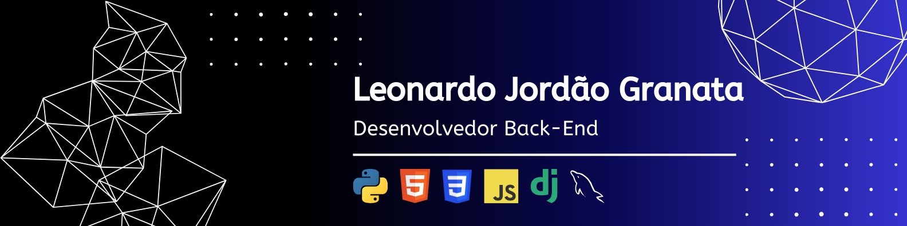

# 💻 Leonardo Jordão Granata — Desenvolvedor Backend em Formação

Seja bem-vindo ao meu perfil. Aqui eu centralizo meus projetos práticos de desenvolvimento backend, onde aplico conceitos de arquitetura, APIs e manipulação de dados para resolver problemas reais.
Os repositórios refletem minha evolução técnica desde fundamentos até aplicações mais estruturadas, sempre com foco em código limpo, organização e tomada de decisão técnica.

## 🧠 Sobre mim

Sou estudante de Ciência da Computação na UNIP, com formação técnica em Desenvolvimento de Sistemas pelo SENAI.
Atuo com foco em backend, desenvolvendo APIs, integrações e sistemas orientados a dados. Busco evoluir constantemente em arquitetura de software, boas práticas e construção de aplicações escaláveis.

## 🛠️ Tecnologias que eu domino

### Linguagens  

 

 

### Frameworks  

### Bancos de Dados  

### Ferramentas e Versionamento  

  
  
  
  
  
  
  

## 📊 GitHub Stats

  

## 📬 Meus Contatos

